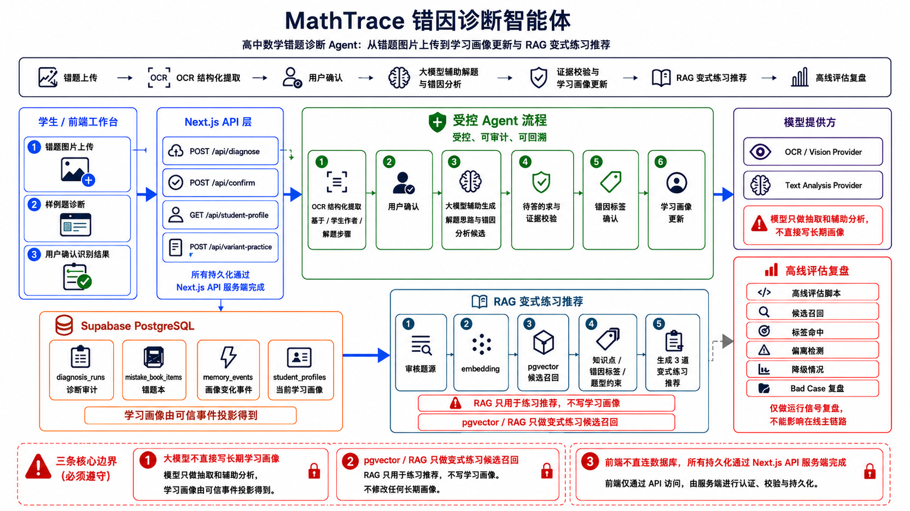

# MathTrace 错因诊断智能体

MathTrace 是一个面向高中数学错题诊断场景的 AI 应用项目。它不是简单的拍照搜题，而是把错题图片识别、用户确认、大模型辅助分析、学习画像更新和变式练习推荐串成一个可解释、可回顾的学习诊断闭环。



技术栈：

- Next.js App Router / TypeScript / React / Tailwind CSS
- Supabase PostgreSQL / pgvector
- OCR / Vision Provider / Text Analysis Provider
- RAG 变式练习推荐
- Node.js 脚本测试、smoke test 和离线评估

## 项目流程

错题上传 -> OCR 结构化抽取 -> 用户确认 -> 大模型辅助解题与错因分析 -> 证据校验与学习画像更新 -> RAG 变式练习推荐 -> 离线评估复盘

## 项目亮点

- 受控 Agent 流程：将一次错题诊断拆分为图片抽取、确认、解题说明、错因分析、画像更新和练习推荐等步骤，避免把长期学习状态完全交给大模型自由生成。
- 可信写入边界：OCR / 视觉模型只负责抽取题干、学生作答和解题步骤；用户确认后，大模型可生成解题说明和错因分析候选；最终错因标签、学习记录写入和画像更新必须经过标签约束与证据校验。
- 结构化长期记忆：确认后的诊断事实写入 Postgres，画像变化以事件形式保存，再投影为当前学习画像，便于解释“为什么学生画像发生变化”。
- RAG 变式练习推荐：将审核题源用于变式练习召回，pgvector 只负责候选题检索，最终推荐仍受知识点、错因标签和题型约束，不参与画像写入。
- 离线评估闭环：通过固定诊断样例评估候选召回、标签命中、偏题检测和降级情况，区分检索质量、题源标签缺口和低证据表述问题。

## 架构边界

MathTrace 的核心边界是：模型可以辅助抽取和表达，但不能直接写入长期画像。

```text
前端工作台
  -> /api/diagnose
      sample_diagnosis: 内置样例题诊断，不依赖外部模型
      image_diagnosis: 调用 OCR / vision provider，返回待确认识别草稿
  -> /api/confirm
      用户确认后进入诊断流程，可选调用 text analysis provider 增强解题说明
      证据不足或 provider 不可用时回退本地规则报告
  -> /api/student-profile
      读取从画像事件投影得到的当前学习画像
  -> /api/variant-practice
      RAG 变式练习推荐，只返回裁剪后的学生可见练习卡片
```

数据分层：

- `diagnosis_runs`：一次诊断运行的审计快照。
- `mistake_book_items`：错题本条目。
- `memory_events`：画像变化事件，记录为什么画像发生变化。
- `student_profiles`：从画像事件投影得到的当前学习画像。
- pgvector 题源表：用于变式练习候选召回，不写学生画像。

当前项目仍是 demo-first 的求职展示项目：默认学生为 `demo_student_001`，尚未实现真实登录、多用户权限、老师端、面向用户的 RLS 策略或生产级监控。

## 快速开始

克隆项目后安装依赖：

```bash
npm install
npm run dev
```

打开 [http://localhost:3000](http://localhost:3000) 进入 MathTrace 工作台。

不配置任何 API Key 时，内置样例题诊断路径仍可运行。图片诊断、确认后文本增强、Supabase 持久化和 pgvector 检索都是可选能力。

## 本地配置

所有密钥只应写入本地 `.env.local`，不要提交 `.env*`，也不要把真实 API Key 写入日志、截图、文档或提交历史。

### OCR / Vision Provider

图片诊断需要服务端 vision provider。GLM-OCR 示例：

```bash
VISION_PROVIDER_PROTOCOL=glm_ocr
VISION_PROVIDER_BASE_URL=https://open.bigmodel.cn/api/paas/v4
VISION_PROVIDER_MODEL=glm-ocr
VISION_PROVIDER_API_KEY=<local-secret>
VISION_PROVIDER_NAME=glm_ocr
VISION_PROVIDER_IMAGE_FORMAT=data_url
VISION_PROVIDER_TIMEOUT_MS=60000
MATHTRACE_CONFIRM_SECRET=<stable-local-secret>
```

OpenAI-compatible vision provider 示例：

```bash
VISION_PROVIDER_PROTOCOL=openai
VISION_PROVIDER_BASE_URL=https://open.bigmodel.cn/api/paas/v4
VISION_PROVIDER_MODEL=glm-4.6v-flashx
VISION_PROVIDER_API_KEY=<local-secret>
VISION_PROVIDER_NAME=glm_4_6v_flashx
VISION_PROVIDER_IMAGE_FORMAT=base64
VISION_PROVIDER_TIMEOUT_MS=60000
MATHTRACE_CONFIRM_SECRET=<stable-local-secret>
```

`MATHTRACE_CONFIRM_SECRET` 用于确认 token 签名。本地未配置时会使用 demo secret；生产环境必须显式配置。

### Text Analysis Provider

确认图片识别结果后，可以配置文本分析模型生成更自然的解题说明和错因分析候选。模型输出不能直接写入画像。

```bash
ANALYSIS_PROVIDER_PROTOCOL=openai
ANALYSIS_PROVIDER_BASE_URL=https://api.deepseek.com
ANALYSIS_PROVIDER_MODEL=deepseek-v4-flash
ANALYSIS_PROVIDER_API_KEY=<local-secret>
ANALYSIS_PROVIDER_NAME=deepseek_v4_flash
ANALYSIS_PROVIDER_TIMEOUT_MS=60000
```

未配置或调用失败时，确认流程会回退到本地规则报告。

### Supabase PostgreSQL

如需启用错题本、画像事件和当前画像快照：

```bash
SUPABASE_URL=<your-supabase-project-url>
SUPABASE_SERVICE_ROLE_KEY=<local-service-role-secret>
```

`SUPABASE_SERVICE_ROLE_KEY` 只能在服务端读取。浏览器端只通过 Next.js API 访问错题本和画像数据，不能直连 Supabase。

需要应用的 migration 位于 `supabase/migrations/`。

### pgvector / RAG

如需启用 pgvector 变式练习候选召回，需要配置 Supabase 和 embedding provider：

```bash
RAG_EMBEDDING_PROVIDER_PROTOCOL=openai
RAG_EMBEDDING_PROVIDER_BASE_URL=https://api.openai.com/v1
RAG_EMBEDDING_PROVIDER_MODEL=text-embedding-3-small
RAG_EMBEDDING_PROVIDER_API_KEY=<local-secret>
RAG_EMBEDDING_PROVIDER_NAME=rag_embedding_provider
RAG_EMBEDDING_PROVIDER_TIMEOUT_MS=30000
RAG_PGVECTOR_QUERY_TIMEOUT_MS=10000
```

同步审核题源到 pgvector：

```bash
node scripts/rag/sync-variant-practice-pgvector.mjs --dry-run
node --env-file=.env.local scripts/rag/sync-variant-practice-pgvector.mjs --apply
```

未配置 Supabase、embedding provider 或本地题源 artifact 时，主诊断流程仍可运行；RAG 推荐能力会按当前可用资源降级。

## 常用命令

```bash
npm run dev
npm test
npm run test:smoke
npm run test:eval
npm run lint
npm run build
```

命令说明：

- `npm test`：运行默认测试并执行 smoke test。
- `npm run test:smoke`：验证核心 demo 路径和 API contract。
- `npm run test:eval`：运行评估类测试。
- `npm run build`：执行 Next.js 构建。

## 目录速览

```text
src/app/api/diagnose/route.ts              诊断入口
src/app/api/confirm/route.ts               图片识别确认入口
src/app/api/student-profile/route.ts       当前学习画像读取
src/app/api/variant-practice/route.ts      RAG 变式练习推荐
src/lib/diagnosis/                         诊断流程、证据策略、确认服务
src/lib/vision-extraction/                 OCR / 视觉抽取解析和映射
src/lib/providers/                         外部模型 provider adapter
src/lib/persistence/                       Supabase / Postgres 持久化边界
src/lib/rag/                               变式练习查询、展示模型和 embedding 文本
scripts/rag/                               题源构建、pgvector 同步和离线评估脚本
supabase/migrations/                       数据库 schema 和 RPC
interview/mathtrace-project-narrative.md   项目面试叙事与设计取舍
```

## 当前限制

- 当前固定使用 `demo_student_001`，不是完整多用户系统。
- 尚未实现登录、老师端、真实用户级 RLS 策略和生产级监控。
- pgvector 只服务变式练习候选召回，不是学生记忆系统。
- RAG 推荐不写学习画像，不影响错题本和画像事件。
- P2.10 评估是本地离线评估，不是线上 A/B 实验或生产监控。
