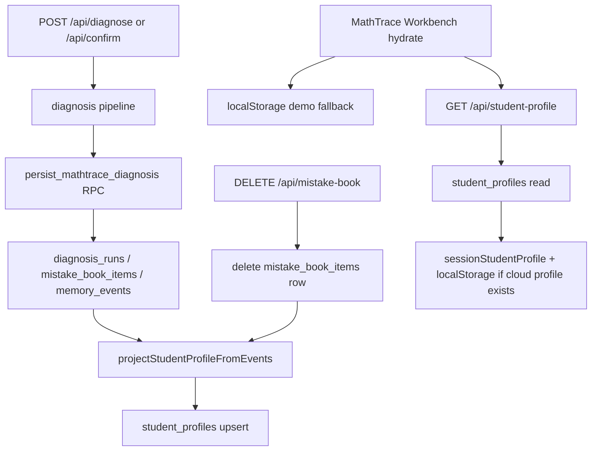

# P1.8 Cloud Student Profile Memory Implementation Plan

> **For agentic workers:** REQUIRED SUB-SKILL: Use superpowers:subagent-driven-development (recommended) or superpowers:executing-plans to implement this plan task-by-task. Steps use checkbox (`- [ ]`) syntax for tracking.

**Goal:** 完成 P1.8「云端学生画像记忆系统 MVP」：把现有 `memory_events` 从“只记录画像变化事件”推进到“可聚合、可恢复、可解释的云端当前学生画像”。系统仍固定 `demo_student_001`，保持前端不直连数据库，保持 `sample_diagnosis` 稳定演示路径。

**Architecture:** 采用 `memory_events` 事件日志 + `student_profiles` 当前快照的组合。`student_profiles.profile` 只能由同一个投影函数从 `demoStudentProfile` 和当前 `memory_events` 折叠生成，不能直接保存模型或诊断响应里的 `response.student_profile`。诊断持久化和错题删除后重建都走同一投影函数。前端启动时先用 `localStorage` demo fallback，再从服务端 `GET /api/student-profile` 恢复云端画像；云端无画像或读取失败时不得覆盖本地 fallback。

**Tech Stack:** Next.js App Router + TypeScript + Supabase Postgres + Zod/运行时类型守卫 + 现有 Node script tests。

---

## Current Constraints

- 固定学生：`demo_student_001`。
- 不做登录、真实多用户、老师端、家长端、RLS 用户策略、RAG、pgvector、Milvus、Storage、外部 memory provider。
- 前端不得直连 Supabase，不得读取 service role key。
- 不存完整图片 base64。
- `localStorage` 继续作为 demo fallback，不代表完整云端画像。
- `sample_diagnosis` 路径不能被数据库、真实模型 provider 或新 API 破坏。
- `student_profiles.profile` 必须通过 `memory_events` 投影生成，不允许直接写入 `response.student_profile`。
- `docs/reviews/*.md` 默认本地保留，不提交。

## Files To Add

- `supabase/migrations/20260617000000_p18_student_profiles.sql`
- `src/lib/persistence/student-profile-persistence.ts`
- `src/lib/student-profile/student-profile-service.ts`
- `src/lib/student-profile/student-profile-client.ts`
- `src/app/api/student-profile/route.ts`
- `scripts/tests/persistence/student-profile-persistence.test.mjs`

## Files To Modify

- `scripts/run-tests.mjs`
- `src/lib/persistence/diagnosis-persistence.ts`
- `src/lib/diagnosis/diagnose-service.ts`
- `src/lib/diagnosis/confirm-service.ts`
- `src/lib/mistake-book/mistake-book-service.ts`
- `src/lib/mistake-book/mistake-book-client.ts`
- `src/components/mathtrace-workbench.tsx`
- `scripts/tests/persistence/diagnosis-persistence.test.mjs`
- `scripts/tests/persistence/mistake-book-api.test.mjs`
- `scripts/tests/ui/mathtrace-workbench-ui.test.mjs`
- `docs/superpowers/specs/2026-05-28-math-mistake-agent-prd.md`
- `docs/TECHNICAL_ROADMAP.md`
- `interview/mathtrace-project-narrative.md`

---

## Data Model

Create `student_profiles` as the cloud current read model:

```sql
create table if not exists public.student_profiles (
  student_id text primary key references public.students(id) on delete cascade,
  subject text not null default 'math',
  grade text not null,
  profile jsonb not null,
  profile_version integer not null default 1,
  event_count integer not null default 0,
  last_memory_event_id uuid references public.memory_events(id) on delete set null,
  created_at timestamptz not null default now(),
  updated_at timestamptz not null default now(),
  constraint student_profiles_subject_check check (subject = 'math'),
  constraint student_profiles_demo_student_check check (student_id = 'demo_student_001'),
  constraint student_profiles_event_count_check check (event_count >= 0),
  constraint student_profiles_profile_is_object_check check (jsonb_typeof(profile) = 'object')
);
```

Service role only:

```sql
alter table public.student_profiles enable row level security;
grant select, insert, update on public.student_profiles to service_role;
```

No `anon` / `authenticated` grants in P1.8.

---

## Data Flow



Projection invariant:

```ts
student_profiles.profile
  === fold(demoStudentProfile, memory_events.orderBy(created_at asc, id asc))
```

---

## Task 1: Add Migration And Schema Tests

**Goal:** Add a minimal `student_profiles` table that supports one demo student and service-side reads/writes only.

**Success criteria:**
- Migration creates `public.student_profiles`.
- Table has demo-student and math-subject constraints.
- Table stores `profile`, `event_count`, and `last_memory_event_id`.
- RLS is enabled and only `service_role` is granted access.

### Steps

- [ ] Create failing migration assertions in `scripts/tests/persistence/student-profile-persistence.test.mjs`:

```js
import assert from "node:assert/strict";
import { readFileSync } from "node:fs";
import { join } from "node:path";

const repoRoot = process.cwd();
const migrationPath = join(
  repoRoot,
  "supabase/migrations/20260617000000_p18_student_profiles.sql",
);

function readMigration() {
  return readFileSync(migrationPath, "utf8");
}

{
  const sql = readMigration();
  assert.match(sql, /create table if not exists public\.student_profiles/);
  assert.match(sql, /student_id text primary key references public\.students\(id\) on delete cascade/);
  assert.match(sql, /grade text not null/);
  assert.match(sql, /profile jsonb not null/);
  assert.match(sql, /event_count integer not null default 0/);
  assert.match(sql, /last_memory_event_id uuid references public\.memory_events\(id\) on delete set null/);
  assert.match(sql, /student_profiles_demo_student_check check \(student_id = 'demo_student_001'\)/);
  assert.match(sql, /student_profiles_subject_check check \(subject = 'math'\)/);
  assert.match(sql, /alter table public\.student_profiles enable row level security/);
  assert.match(sql, /grant select, insert, update on public\.student_profiles to service_role/);
  assert.doesNotMatch(sql, /grant .* on public\.student_profiles to anon/);
  assert.doesNotMatch(sql, /grant .* on public\.student_profiles to authenticated/);
}

console.log("student profile persistence tests passed");
```

- [ ] Run the test and confirm it fails because the migration file does not exist:

```bash
node scripts/tests/persistence/student-profile-persistence.test.mjs
```

Expected failure includes `ENOENT`.

- [ ] Add `supabase/migrations/20260617000000_p18_student_profiles.sql`:

```sql
-- P1.8: Cloud current student profile read model.
-- The source of truth remains public.memory_events; this table stores the
-- latest projected snapshot for fast demo recovery.

create table if not exists public.student_profiles (
  student_id text primary key references public.students(id) on delete cascade,
  subject text not null default 'math',
  grade text not null,
  profile jsonb not null,
  profile_version integer not null default 1,
  event_count integer not null default 0,
  last_memory_event_id uuid references public.memory_events(id) on delete set null,
  created_at timestamptz not null default now(),
  updated_at timestamptz not null default now(),
  constraint student_profiles_subject_check check (subject = 'math'),
  constraint student_profiles_demo_student_check check (student_id = 'demo_student_001'),
  constraint student_profiles_event_count_check check (event_count >= 0),
  constraint student_profiles_profile_is_object_check check (jsonb_typeof(profile) = 'object')
);

alter table public.student_profiles enable row level security;

grant select, insert, update on public.student_profiles to service_role;
```

- [ ] Add the new test file to `scripts/run-tests.mjs` default suite near other persistence tests.

- [ ] Run:

```bash
node scripts/tests/persistence/student-profile-persistence.test.mjs
```

Expected output:

```text
student profile persistence tests passed
```

- [ ] Commit only this task:

```bash
git status --short
git add supabase/migrations/20260617000000_p18_student_profiles.sql scripts/tests/persistence/student-profile-persistence.test.mjs scripts/run-tests.mjs
git commit -m "test: add p18 student profile schema guard"
```

---

## Task 2: Implement Shared Projection Service

**Goal:** Add the one canonical projection path:

```ts
student_profiles.profile = fold(demoStudentProfile, current memory_events)
```

**Success criteria:**
- Events are sorted by `created_at asc, id asc`.
- Projection starts from `demoStudentProfile`.
- Every event `memory_delta` is runtime-guarded before applying.
- Invalid event or invalid resulting profile returns failure and does not upsert.
- Empty events produce the demo profile with `event_count = 0`.

### Steps

- [ ] Extend `scripts/tests/persistence/student-profile-persistence.test.mjs` with projection tests:

```js
import { createProjectJiti } from "../../test-support/project-jiti.mjs";

const jiti = createProjectJiti();
const { demoStudentProfile } = jiti("./src/data/mathtrace-demo.ts");

const {
  projectStudentProfileFromEvents,
  syncProjectedStudentProfile,
  PROFILE_SYNC_FAILED_WARNING,
} = jiti("./src/lib/student-profile/student-profile-service.ts");

function memoryDelta(overrides = {}) {
  return {
    should_persist: true,
    rationale: "",
    knowledge_mastery_changes: { parameter_classification: -5 },
    mistake_cause_changes: { concept_confusion: 1 },
    review_priority_changes: ["parameter_classification"],
    is_repeated_mistake: true,
    ...overrides,
  };
}

{
  const result = projectStudentProfileFromEvents([
    { id: "b", created_at: "2026-06-17T00:00:01.000Z", memory_delta: memoryDelta({ review_priority_changes: ["function_monotonicity"] }) },
    { id: "a", created_at: "2026-06-17T00:00:00.000Z", memory_delta: memoryDelta({ review_priority_changes: ["parameter_classification"] }) },
  ]);

  assert.equal(result.status, "projected");
  assert.equal(result.event_count, 2);
  assert.equal(result.last_memory_event_id, "b");
  assert.deepEqual(result.profile.review_priority.slice(0, 2), [
    "function_monotonicity",
    "parameter_classification",
  ]);
}

{
  const result = projectStudentProfileFromEvents([]);
  assert.equal(result.status, "projected");
  assert.equal(result.event_count, 0);
  assert.equal(result.last_memory_event_id, null);
  assert.deepEqual(result.profile, demoStudentProfile);
}

{
  const result = projectStudentProfileFromEvents([
    { id: "bad", created_at: "2026-06-17T00:00:00.000Z", memory_delta: { should_persist: true, knowledge_mastery_changes: { parameter_classification: "bad" } } },
  ]);

  assert.equal(result.status, "failed");
  assert.match(result.warning, /云端画像同步失败/);
}

{
  const result = projectStudentProfileFromEvents([
    { id: "good", created_at: "2026-06-17T00:00:00.000Z", memory_delta: memoryDelta() },
    { id: "bad", created_at: "2026-06-17T00:00:01.000Z", memory_delta: { should_persist: true } },
  ]);

  assert.equal(result.status, "failed");
}
```

- [ ] Run and confirm failure because the module does not exist or exports are missing:

```bash
node scripts/tests/persistence/student-profile-persistence.test.mjs
```

- [ ] Add `src/lib/persistence/student-profile-persistence.ts` with repository interfaces and Supabase implementation only. Do not put projection or fold logic in this file:

```ts
import type { StudentProfile } from "@/lib/shared/student-profile";
import {
  createSupabaseAdminClient,
  getSupabaseAdminConfig,
} from "@/lib/persistence/supabase-admin";

export const DEMO_STUDENT_ID = "demo_student_001";

export interface ProfileMemoryEvent {
  id: string;
  created_at: string;
  memory_delta: unknown;
}

export interface UpsertProjectedStudentProfileInput {
  student_id: string;
  profile: StudentProfile;
  event_count: number;
  last_memory_event_id: string | null;
}

export interface StudentProfileProjectionRepository {
  is_database_configured: boolean;
  listMemoryEvents(student_id: string): Promise<ProfileMemoryEvent[]>;
  upsertProjectedProfile(input: UpsertProjectedStudentProfileInput): Promise<void>;
}

interface SupabaseQueryResult<T> {
  data: T | null;
  error: unknown;
}

interface SupabaseStudentProfileClient {
  from(tableName: string): {
    select(columns: string): {
      eq(column: string, value: string): {
        order(column: string, options: { ascending: boolean }): {
          order(column: string, options: { ascending: boolean }): Promise<SupabaseQueryResult<ProfileMemoryEvent[]>>;
        };
        maybeSingle(): Promise<SupabaseQueryResult<{ profile: unknown }>>;
      };
    };
    upsert(row: Record<string, unknown>, options: { onConflict: string }): Promise<SupabaseQueryResult<unknown>>;
  };
}

export function createDefaultStudentProfileRepository(): StudentProfileProjectionRepository {
  const config = getSupabaseAdminConfig();
  if (!config.ok) {
    return createDisabledStudentProfileRepository();
  }

  return createSupabaseStudentProfileRepository(
    createSupabaseAdminClient(config.value),
  );
}

export function createSupabaseStudentProfileRepository(
  client: SupabaseStudentProfileClient,
): StudentProfileProjectionRepository {
  return {
    is_database_configured: true,

    async listMemoryEvents(student_id: string): Promise<ProfileMemoryEvent[]> {
      const { data, error } = await client
        .from("memory_events")
        .select("id, created_at, memory_delta")
        .eq("student_id", student_id)
        .order("created_at", { ascending: true })
        .order("id", { ascending: true });

      if (error || !Array.isArray(data)) {
        throw new Error("Failed to list memory events");
      }

      return data;
    },

    async upsertProjectedProfile(input: UpsertProjectedStudentProfileInput): Promise<void> {
      const { error } = await client.from("student_profiles").upsert(
        {
          student_id: input.student_id,
          subject: "math",
          grade: input.profile.grade,
          profile: input.profile,
          profile_version: 1,
          event_count: input.event_count,
          last_memory_event_id: input.last_memory_event_id,
          updated_at: new Date().toISOString(),
        },
        { onConflict: "student_id" },
      );

      if (error) {
        throw new Error("Failed to upsert student profile");
      }
    },
  };
}

export function createDisabledStudentProfileRepository(): StudentProfileProjectionRepository {
  return {
    is_database_configured: false,
    async listMemoryEvents(): Promise<ProfileMemoryEvent[]> {
      return [];
    },
    async upsertProjectedProfile(): Promise<void> {
      return;
    },
  };
}
```

- [ ] Add `src/lib/student-profile/student-profile-service.ts` with projection and rebuild orchestration. This file owns the fold logic:

```ts
import { demoStudentProfile, type MemoryDelta } from "@/data/mathtrace-demo";
import {
  applyMemoryDeltaToProfile,
  isStudentProfile,
  type StudentProfile,
} from "@/lib/shared/student-profile";
import {
  createDefaultStudentProfileRepository,
  type ProfileMemoryEvent,
  type StudentProfileProjectionRepository,
} from "@/lib/persistence/student-profile-persistence";

export const PROFILE_SYNC_FAILED_WARNING = "云端画像同步失败，本次操作已保留。";

export type ProfileSyncStatus =
  | "synced"
  | "skipped_database_not_configured"
  | "failed";

export interface ProjectedStudentProfile {
  status: "projected";
  profile: StudentProfile;
  event_count: number;
  last_memory_event_id: string | null;
}

export interface FailedStudentProfileProjection {
  status: "failed";
  warning: string;
}

export type StudentProfileProjectionResult =
  | ProjectedStudentProfile
  | FailedStudentProfileProjection;

export interface ProfileSyncResult {
  status: ProfileSyncStatus;
  warning?: string;
}

export function projectStudentProfileFromEvents(
  events: readonly ProfileMemoryEvent[],
): StudentProfileProjectionResult {
  const sortedEvents = [...events].sort(compareMemoryEvents);
  let profile: StudentProfile = structuredClone(demoStudentProfile);

  for (const event of sortedEvents) {
    const memoryDelta = parseProjectableMemoryDelta(event.memory_delta);
    if (!memoryDelta) {
      return { status: "failed", warning: PROFILE_SYNC_FAILED_WARNING };
    }

    profile = applyMemoryDeltaToProfile(profile, memoryDelta);
    if (!isStudentProfile(profile)) {
      return { status: "failed", warning: PROFILE_SYNC_FAILED_WARNING };
    }
  }

  return {
    status: "projected",
    profile,
    event_count: sortedEvents.length,
    last_memory_event_id: sortedEvents.at(-1)?.id ?? null,
  };
}

export async function syncProjectedStudentProfile(
  student_id: string,
  repository: StudentProfileProjectionRepository = createDefaultStudentProfileRepository(),
): Promise<ProfileSyncResult> {
  if (!repository.is_database_configured) {
    return { status: "skipped_database_not_configured" };
  }

  try {
    const events = await repository.listMemoryEvents(student_id);
    const projection = projectStudentProfileFromEvents(events);
    if (projection.status === "failed") {
      return { status: "failed", warning: projection.warning };
    }

    await repository.upsertProjectedProfile({
      student_id,
      profile: projection.profile,
      event_count: projection.event_count,
      last_memory_event_id: projection.last_memory_event_id,
    });

    return { status: "synced" };
  } catch {
    return { status: "failed", warning: PROFILE_SYNC_FAILED_WARNING };
  }
}

function compareMemoryEvents(a: ProfileMemoryEvent, b: ProfileMemoryEvent): number {
  const createdAtCompare = a.created_at.localeCompare(b.created_at);
  if (createdAtCompare !== 0) {
    return createdAtCompare;
  }
  return a.id.localeCompare(b.id);
}

function parseProjectableMemoryDelta(value: unknown): MemoryDelta | null {
  if (!isRecord(value)) {
    return null;
  }

  const shouldPersist = value.should_persist;
  const knowledge = value.knowledge_mastery_changes;
  const causes = value.mistake_cause_changes;
  const priorities = value.review_priority_changes;
  const repeated = value.is_repeated_mistake;
  const rationale = value.rationale;

  if (typeof shouldPersist !== "boolean") return null;
  if (!isFiniteNumberRecord(knowledge)) return null;
  if (!isFiniteNumberRecord(causes)) return null;
  if (!Array.isArray(priorities) || !priorities.every((item) => typeof item === "string")) return null;
  if (typeof repeated !== "boolean") return null;

  return {
    should_persist: shouldPersist,
    knowledge_mastery_changes: knowledge,
    mistake_cause_changes: causes,
    review_priority_changes: priorities,
    is_repeated_mistake: repeated,
    rationale: typeof rationale === "string" ? rationale : "",
  };
}

function isRecord(value: unknown): value is Record<string, unknown> {
  return typeof value === "object" && value !== null && !Array.isArray(value);
}

function isFiniteNumberRecord(value: unknown): Record<string, number> | null {
  if (!isRecord(value)) return null;

  const entries = Object.entries(value);
  for (const [, item] of entries) {
    if (typeof item !== "number" || !Number.isFinite(item)) {
      return null;
    }
  }

  return Object.fromEntries(entries) as Record<string, number>;
}
```

- [ ] Add sync tests:

```js
{
  const calls = [];
  const result = await syncProjectedStudentProfile("demo_student_001", {
    is_database_configured: true,
    async listMemoryEvents() {
      calls.push("list");
      return [{ id: "event-1", created_at: "2026-06-17T00:00:00.000Z", memory_delta: memoryDelta() }];
    },
    async upsertProjectedProfile(input) {
      calls.push(["upsert", input.event_count, input.last_memory_event_id, input.profile.grade]);
    },
  });

  assert.equal(result.status, "synced");
  assert.deepEqual(calls, ["list", ["upsert", 1, "event-1", "高二"]]);
}

{
  const result = await syncProjectedStudentProfile("demo_student_001", {
    is_database_configured: true,
    async listMemoryEvents() {
      return [{ id: "bad", created_at: "2026-06-17T00:00:00.000Z", memory_delta: { should_persist: true } }];
    },
    async upsertProjectedProfile() {
      throw new Error("must not upsert invalid projection");
    },
  });

  assert.equal(result.status, "failed");
  assert.equal(result.warning, PROFILE_SYNC_FAILED_WARNING);
}
```

- [ ] Run:

```bash
node scripts/tests/persistence/student-profile-persistence.test.mjs
```

- [ ] Commit:

```bash
git status --short
git add src/lib/persistence/student-profile-persistence.ts src/lib/student-profile/student-profile-service.ts scripts/tests/persistence/student-profile-persistence.test.mjs
git commit -m "feat: project cloud student profile from memory events"
```

---

## Task 3: Add Cloud Student Profile Read API And Client

**Goal:** Add a server API that returns cloud profile when available, and safe fallback metadata when not available.

**Success criteria:**
- `GET /api/student-profile?student_id=demo_student_001` returns `profile: StudentProfile | null`.
- Disabled database returns `profile: null`, `source: "fallback"`, `is_database_configured: false`.
- Invalid or failed cloud read returns fallback and never throws a 500 for normal demo recovery.
- Client validates response shape and never reaches Supabase directly.

### Steps

- [ ] Extend `student-profile-persistence.ts` with read repository support. Add `isStudentProfile` to the existing shared import, widen the three repository factory return types to `StudentProfileProjectionRepository & StudentProfileReadRepository`, and add this interface:

```ts
export interface StudentProfileReadRepository {
  is_database_configured: boolean;
  readCurrentProfile(student_id: string): Promise<StudentProfile | null>;
}
```

- [ ] Extend Supabase repository to implement `readCurrentProfile`:

```ts
async readCurrentProfile(student_id: string): Promise<StudentProfile | null> {
  const { data, error } = await client
    .from("student_profiles")
    .select("profile")
    .eq("student_id", student_id)
    .maybeSingle();

  if (error) {
    throw new Error("Failed to read student profile");
  }

  if (!data) {
    return null;
  }

  if (!isStudentProfile(data.profile)) {
    throw new Error("Invalid student profile snapshot");
  }

  return data.profile;
}
```

- [ ] Extend the existing `src/lib/student-profile/student-profile-service.ts` with cloud profile read response handling:

```ts
import {
  createDefaultStudentProfileRepository,
  DEMO_STUDENT_ID,
  type StudentProfileReadRepository,
} from "@/lib/persistence/student-profile-persistence";
import type { StudentProfile } from "@/lib/shared/student-profile";

export const PROFILE_READ_NOT_CONFIGURED_WARNING = "数据库暂未配置，继续使用本地 demo 画像。";
export const PROFILE_READ_FAILED_WARNING = "云端画像暂时读取失败，继续使用本地 demo 画像。";
export const PROFILE_NOT_FOUND_WARNING = "云端画像暂未生成，继续使用本地 demo 画像。";

export interface CloudStudentProfileResponse {
  student_id: string;
  profile: StudentProfile | null;
  source: "cloud" | "fallback";
  is_database_configured: boolean;
  warnings: string[];
}

export interface StudentProfileRequestResult {
  status: number;
  body: CloudStudentProfileResponse | { error: string };
}

export async function handleStudentProfileRequest(
  searchParams: URLSearchParams,
  repository: StudentProfileReadRepository = createDefaultStudentProfileRepository(),
): Promise<StudentProfileRequestResult> {
  const studentId = searchParams.get("student_id") ?? DEMO_STUDENT_ID;

  if (studentId !== DEMO_STUDENT_ID) {
    return { status: 400, body: { error: "P1.8 仅支持 demo_student_001。" } };
  }

  if (!repository.is_database_configured) {
    return {
      status: 200,
      body: {
        student_id: studentId,
        profile: null,
        source: "fallback",
        is_database_configured: false,
        warnings: [PROFILE_READ_NOT_CONFIGURED_WARNING],
      },
    };
  }

  try {
    const profile = await repository.readCurrentProfile(studentId);
    if (!profile) {
      return {
        status: 200,
        body: {
          student_id: studentId,
          profile: null,
          source: "fallback",
          is_database_configured: true,
          warnings: [PROFILE_NOT_FOUND_WARNING],
        },
      };
    }

    return {
      status: 200,
      body: {
        student_id: studentId,
        profile,
        source: "cloud",
        is_database_configured: true,
        warnings: [],
      },
    };
  } catch {
    return {
      status: 200,
      body: {
        student_id: studentId,
        profile: null,
        source: "fallback",
        is_database_configured: true,
        warnings: [PROFILE_READ_FAILED_WARNING],
      },
    };
  }
}
```

- [ ] Create `src/app/api/student-profile/route.ts`:

```ts
import { NextResponse, type NextRequest } from "next/server";

import { handleStudentProfileRequest } from "@/lib/student-profile/student-profile-service";

export async function GET(request: NextRequest): Promise<NextResponse> {
  const result = await handleStudentProfileRequest(request.nextUrl.searchParams);
  return NextResponse.json(result.body, { status: result.status });
}
```

- [ ] Create `src/lib/student-profile/student-profile-client.ts`:

```ts
import { isStudentProfile, type StudentProfile } from "@/lib/shared/student-profile";

export interface CloudStudentProfileClientResponse {
  student_id: string;
  profile: StudentProfile | null;
  source: "cloud" | "fallback";
  is_database_configured: boolean;
  warnings: string[];
}

export interface RequestCloudStudentProfileOptions {
  fetcher?: typeof fetch;
  student_id?: string;
}

export async function requestCloudStudentProfile(
  options: RequestCloudStudentProfileOptions = {},
): Promise<CloudStudentProfileClientResponse> {
  const fetcher = options.fetcher ?? fetch;
  const studentId = options.student_id ?? "demo_student_001";
  const response = await fetcher(`/api/student-profile?student_id=${encodeURIComponent(studentId)}`);

  if (!response.ok) {
    throw new Error("云端画像暂时读取失败。");
  }

  const body: unknown = await response.json();
  if (!isCloudStudentProfileClientResponse(body)) {
    throw new Error("云端画像响应格式无效。");
  }

  return body;
}

function isCloudStudentProfileClientResponse(value: unknown): value is CloudStudentProfileClientResponse {
  if (typeof value !== "object" || value === null || Array.isArray(value)) return false;
  const candidate = value as Record<string, unknown>;
  return (
    typeof candidate.student_id === "string" &&
    (candidate.profile === null || isStudentProfile(candidate.profile)) &&
    (candidate.source === "cloud" || candidate.source === "fallback") &&
    typeof candidate.is_database_configured === "boolean" &&
    Array.isArray(candidate.warnings) &&
    candidate.warnings.every((item) => typeof item === "string")
  );
}
```

- [ ] Add tests in `student-profile-persistence.test.mjs` for:
  - disabled read fallback.
  - cloud profile success.
  - invalid student_id returns 400.
  - repository read failure returns fallback.
  - client accepts valid response.
  - client rejects malformed response.

- [ ] Run:

```bash
node scripts/tests/persistence/student-profile-persistence.test.mjs
```

- [ ] Commit:

```bash
git status --short
git add src/lib/student-profile src/app/api/student-profile src/lib/persistence/student-profile-persistence.ts scripts/tests/persistence/student-profile-persistence.test.mjs
git commit -m "feat: add cloud student profile read api"
```

---

## Task 4: Sync Profile After Diagnosis Persistence

**Goal:** After diagnosis RPC writes `memory_events`, rebuild `student_profiles` through the canonical projection. Duplicate diagnosis should not trigger a profile rebuild.

**Success criteria:**
- Persisted diagnosis triggers `syncProjectedStudentProfile`.
- Duplicate diagnosis does not rebuild profile.
- Projection failure appends a warning but keeps diagnosis API status successful.
- `response.student_profile` is never used as the value to upsert into `student_profiles`.

### Steps

- [ ] Add failing tests in `scripts/tests/persistence/diagnosis-persistence.test.mjs`:

```js
{
  const profileSyncCalls = [];
  const result = await handleDiagnoseRequest(createSamplePayload(), {
    persistence_repository: createRecordingRepository({ status: "persisted" }),
    student_profile_repository: {
      is_database_configured: true,
      async listMemoryEvents(studentId) {
        profileSyncCalls.push(["list", studentId]);
        return [];
      },
      async upsertProjectedProfile(input) {
        profileSyncCalls.push(["upsert", input.student_id, input.event_count]);
      },
    },
  });

  assert.equal(result.status, 200);
  assert.deepEqual(profileSyncCalls, [
    ["list", "demo_student_001"],
    ["upsert", "demo_student_001", 0],
  ]);
}

{
  const profileSyncCalls = [];
  const result = await handleDiagnoseRequest(createSamplePayload(), {
    persistence_repository: createRecordingRepository({ status: "duplicate" }),
    student_profile_repository: {
      is_database_configured: true,
      async listMemoryEvents() {
        profileSyncCalls.push("list");
        return [];
      },
      async upsertProjectedProfile() {
        profileSyncCalls.push("upsert");
      },
    },
  });

  assert.equal(result.status, 200);
  assert.deepEqual(profileSyncCalls, []);
}

{
  const result = await handleDiagnoseRequest(createSamplePayload(), {
    persistence_repository: createRecordingRepository({ status: "persisted" }),
    student_profile_repository: {
      is_database_configured: true,
      async listMemoryEvents() {
        return [{ id: "bad", created_at: "2026-06-17T00:00:00.000Z", memory_delta: { should_persist: true } }];
      },
      async upsertProjectedProfile() {
        throw new Error("must not write invalid profile");
      },
    },
  });

  assert.equal(result.status, 200);
  assert.ok(result.body.warnings.includes("云端画像同步失败，本次操作已保留。"));
}
```

- [ ] Modify `src/lib/diagnosis/diagnose-service.ts`:

```ts
import {
  PROFILE_SYNC_FAILED_WARNING,
  syncProjectedStudentProfile,
} from "@/lib/student-profile/student-profile-service";
import type { StudentProfileProjectionRepository } from "@/lib/persistence/student-profile-persistence";

interface DiagnoseServiceDependencies {
  vision_provider?: VisionExtractionProvider;
  persistence_repository?: DiagnosisPersistenceRepository;
  student_profile_repository?: StudentProfileProjectionRepository;
}

export async function persistDiagnosisIfNeeded(
  result: DiagnoseServiceResult,
  repository?: DiagnosisPersistenceRepository,
  studentProfileRepository?: StudentProfileProjectionRepository,
): Promise<DiagnoseServiceResult> {
  if (result.status !== 200) {
    return result;
  }

  const persistenceResult = await persistDiagnosisResponse(result.body, repository);
  const warnings = [
    ...(result.body.warnings ?? []),
    ...getPersistenceWarnings(persistenceResult),
  ];

  if (persistenceResult.status === "persisted") {
    const profileSync = await syncProjectedStudentProfile(
      result.body.student_id,
      studentProfileRepository,
    );
    if (profileSync.status === "failed") {
      warnings.push(profileSync.warning ?? PROFILE_SYNC_FAILED_WARNING);
    }
  }

  if (warnings.length === 0) {
    return result;
  }

  return { ...result, body: { ...result.body, warnings } };
}
```

- [ ] Update calls to pass `deps?.student_profile_repository`.

- [ ] Modify `src/lib/diagnosis/confirm-service.ts` dependency interface and pass the profile repository through to `persistDiagnosisIfNeeded`.

- [ ] Run:

```bash
node scripts/tests/persistence/diagnosis-persistence.test.mjs
```

- [ ] Commit:

```bash
git status --short
git add src/lib/diagnosis/diagnose-service.ts src/lib/diagnosis/confirm-service.ts scripts/tests/persistence/diagnosis-persistence.test.mjs
git commit -m "feat: sync cloud profile after diagnosis persistence"
```

---

## Task 5: Sync Profile After Mistake Book Delete

**Goal:** Deleting a mistake book item removes its related current `memory_events`; after deletion, rebuild cloud profile from remaining events.

**Success criteria:**
- Successful delete triggers profile projection.
- Delete failure does not attempt projection.
- API response includes `profile_sync_status`.
- Client validator accepts the new field.

### Steps

- [ ] Update `src/lib/mistake-book/mistake-book-service.ts` response type:

```ts
import {
  syncProjectedStudentProfile,
  type ProfileSyncStatus,
} from "@/lib/student-profile/student-profile-service";
import type { StudentProfileProjectionRepository } from "@/lib/persistence/student-profile-persistence";

export interface MistakeBookDeleteResponse {
  student_id: string;
  item_id: string;
  deleted: boolean;
  is_database_configured: boolean;
  profile_sync_status: ProfileSyncStatus;
  warnings: string[];
}

interface MistakeBookServiceOptions {
  repository?: MistakeBookRepository;
  student_profile_repository?: StudentProfileProjectionRepository;
}
```

- [ ] In the successful delete branch, add:

```ts
const profileSync = await syncProjectedStudentProfile(
  parsed.student_id,
  options.student_profile_repository,
);

return {
  status: 200,
  body: {
    student_id: parsed.student_id,
    item_id: parsed.item_id,
    deleted: true,
    is_database_configured: repository.is_database_configured,
    profile_sync_status: profileSync.status,
    warnings: profileSync.status === "failed" && profileSync.warning
      ? [profileSync.warning]
      : [],
  },
};
```

- [ ] For disabled database branch, set:

```ts
profile_sync_status: "skipped_database_not_configured"
```

- [ ] For delete failure branch, set:

```ts
profile_sync_status: "failed"
```

Keep `deleted: false` in the same response so callers can distinguish "delete failed before profile sync" from "delete succeeded but profile sync failed".

- [ ] Update `src/lib/mistake-book/mistake-book-client.ts` type guard:

```ts
function isProfileSyncStatus(value: unknown): value is ProfileSyncStatus {
  return (
    value === "synced" ||
    value === "skipped_database_not_configured" ||
    value === "failed"
  );
}
```

- [ ] Add tests in `scripts/tests/persistence/mistake-book-api.test.mjs`:
  - successful delete syncs profile.
  - failed delete does not call profile repository.
  - delete client rejects response without `profile_sync_status`.
  - delete client accepts all three status values.

- [ ] Run:

```bash
node scripts/tests/persistence/mistake-book-api.test.mjs
```

- [ ] Commit:

```bash
git status --short
git add src/lib/mistake-book/mistake-book-service.ts src/lib/mistake-book/mistake-book-client.ts scripts/tests/persistence/mistake-book-api.test.mjs
git commit -m "feat: rebuild cloud profile after mistake delete"
```

---

## Task 6: Hydrate Workbench From Cloud Profile

**Goal:** Keep the current fast demo fallback, then recover cloud profile when available. Cloud fallback must not overwrite `localStorage`.

**Success criteria:**
- Workbench imports only the HTTP client, not Supabase.
- Hydration still starts from `localStorage` or `demoStudentProfile`.
- If cloud response has `profile`, update session state and write that profile to `localStorage`.
- If cloud response has `profile: null`, keep existing local fallback unchanged.
- After diagnosis and delete, refresh cloud profile so UI aligns with the projected snapshot.

### Steps

- [ ] Before editing, read `src/components/mathtrace-workbench.tsx` and confirm the current names for:
  - session profile state setter: `setSessionStudentProfile`
  - hydration flag: `hasHydrated`
  - mistake-book refresh callback: `refreshMistakeBook`
  - localStorage writer: `writeStoredStudentProfile`

- [ ] Add source-level tests in `scripts/tests/ui/mathtrace-workbench-ui.test.mjs`:

```js
assert.match(source, /requestCloudStudentProfile/);
assert.doesNotMatch(source, /createSupabaseAdminClient|@supabase\/supabase-js/);
assert.match(source, /if \(cloudProfile\.profile\)/);
assert.match(source, /writeStoredStudentProfile\(window\.localStorage, cloudProfile\.profile\)/);
assert.match(source, /await refreshCloudStudentProfile\(\)/);
```

- [ ] Modify `src/components/mathtrace-workbench.tsx` imports:

```ts
import { requestCloudStudentProfile } from "@/lib/student-profile/student-profile-client";
```

- [ ] Add a cloud refresh callback near `refreshMistakeBook`:

```ts
const refreshCloudStudentProfile = useCallback(async (): Promise<void> => {
  if (!hasHydrated) {
    return;
  }

  try {
    const cloudProfile = await requestCloudStudentProfile();
    if (cloudProfile.profile) {
      setSessionStudentProfile(cloudProfile.profile);
      writeStoredStudentProfile(window.localStorage, cloudProfile.profile);
    }
  } catch {
    // Demo fallback remains localStorage/demoStudentProfile; cloud recovery is best-effort.
  }
}, [hasHydrated]);
```

- [ ] Add effect after hydration:

```ts
useEffect(() => {
  if (!hasHydrated) {
    return;
  }

  void refreshCloudStudentProfile();
}, [hasHydrated, refreshCloudStudentProfile]);
```

- [ ] After successful sample/confirm diagnosis and mistake-book refresh, add:

```ts
await refreshCloudStudentProfile();
```

- [ ] After successful mistake-book delete and `refreshMistakeBook()`, add:

```ts
await refreshCloudStudentProfile();
```

- [ ] Run:

```bash
node scripts/tests/ui/mathtrace-workbench-ui.test.mjs
node scripts/tests/demo/demo-state.test.mjs
```

- [ ] Commit:

```bash
git status --short
git add src/components/mathtrace-workbench.tsx scripts/tests/ui/mathtrace-workbench-ui.test.mjs
git commit -m "feat: hydrate workbench from cloud student profile"
```

---

## Task 7: Documentation Updates

**Goal:** Keep PRD, roadmap, and interview narrative aligned with the implemented memory boundary.

**Success criteria:**
- PRD states `student_profiles` is a projected read model, not model output storage.
- Roadmap marks P1.8 as cloud profile aggregation/recovery MVP and keeps RAG as later work.
- Interview narrative can explain why Postgres structured memory comes before RAG.

### Steps

- [ ] Update `docs/superpowers/specs/2026-05-28-math-mistake-agent-prd.md`:
  - Add `student_profiles` table to persistence model.
  - State projection invariant.
  - State `GET /api/student-profile` contract.
  - State non-goals: login, RLS user policies, RAG, vector DB.

- [ ] Update `docs/TECHNICAL_ROADMAP.md`:
  - P1.8: current cloud profile snapshot + recovery.
  - Future: RAG / pgvector / Milvus as retrieval layer after structured memory is stable.

- [ ] Update `interview/mathtrace-project-narrative.md` with a P1.8 section:
  - 功能价值：Demo 从本地 fallback 进化到云端画像恢复。
  - 关键设计：事件日志 + 当前快照。
  - 取舍：先 Postgres 结构化聚合，不先做 RAG。
  - 证据：migration、projection tests、API tests、smoke tests。

- [ ] Run:

```bash
git diff -- docs/superpowers/specs/2026-05-28-math-mistake-agent-prd.md docs/TECHNICAL_ROADMAP.md interview/mathtrace-project-narrative.md
```

- [ ] Commit:

```bash
git status --short
git add docs/superpowers/specs/2026-05-28-math-mistake-agent-prd.md docs/TECHNICAL_ROADMAP.md interview/mathtrace-project-narrative.md
git commit -m "docs: document p18 cloud profile memory"
```

---

## Task 8: Full Verification And Local Review

**Goal:** Verify the whole P1.8 slice and get a Claude Code review before integration.

### Required Commands

Run targeted tests first:

```bash
node scripts/tests/persistence/student-profile-persistence.test.mjs
node scripts/tests/persistence/diagnosis-persistence.test.mjs
node scripts/tests/persistence/mistake-book-api.test.mjs
node scripts/tests/ui/mathtrace-workbench-ui.test.mjs
node scripts/tests/demo/demo-state.test.mjs
```

Then run suite-level checks:

```bash
npm run test:smoke
npm test
npm run lint
npm run build
```

If `npm run build` fails with sandbox-only Turbopack or port permission errors, record the exact error and rerun in an approved environment before claiming build success.

### Claude Code Review Prompt

Write review output to:

```text
docs/reviews/2026-06-17-p18-cloud-student-profile-memory-review.md
```

Prompt:

```md
请以代码审查方式检查 MathTrace P1.8 云端学生画像记忆系统实现。

重点检查：
1. `student_profiles.profile` 是否只由 `memory_events` 投影生成，是否存在直接保存 `response.student_profile` 的路径。
2. 诊断持久化和错题删除后是否使用同一个投影函数。
3. 投影失败、数据库未配置、云端读取失败时，是否保持主流程成功并给出清晰 warning。
4. 前端是否只通过 `/api/student-profile` 恢复云端画像，是否没有直连 Supabase 或读取 service role key。
5. `sample_diagnosis`、duplicate warning、localStorage fallback、错题删除是否有回归风险。
6. 数据库 migration 是否符合 P1.8 边界：demo student only、service_role only、不做真实多用户 RLS。
7. 测试是否覆盖排序投影、非法事件、删除后重建、云端恢复 fallback、客户端响应校验。

请按严重程度输出：
- High / Medium / Low findings
- 文件和行号
- 为什么是问题
- 建议修复方式

如果没有 High / Medium blocker，请明确说明可以进入修复 Low 或准备合并。
```

### Final Integration Gate

- [ ] Fix accepted review findings.
- [ ] Rerun impacted tests.
- [ ] Rerun `npm test`.
- [ ] Show `git status --short` before final commit or merge.
- [ ] Do not stage `docs/reviews/*.md` unless the user explicitly asks.
- [ ] If user chooses local merge flow, update `main`, merge feature branch, rerun required checks on `main`, then push `main`.

---

## Rollback Strategy

- If projection causes diagnosis API regressions, temporarily skip `syncProjectedStudentProfile` warning path while preserving `memory_events`.
- If cloud profile read fails in production demo, frontend remains functional because localStorage/demo fallback is unchanged.
- If migration must be reverted before data exists, drop only `public.student_profiles`; do not modify `memory_events`, `diagnosis_runs`, or `mistake_book_items`.

---

## Non-Goals Reconfirmed

- No login/Auth integration.
- No real multi-user support.
- No teacher/parent dashboard.
- No RLS user policy design.
- No RAG, pgvector, Milvus, semantic search, or external memory provider.
- No image base64 persistence.
- No generic profile repair/admin endpoint.
- No model-generated direct writes into `student_profiles`.
- No removal of `localStorage` demo fallback.
